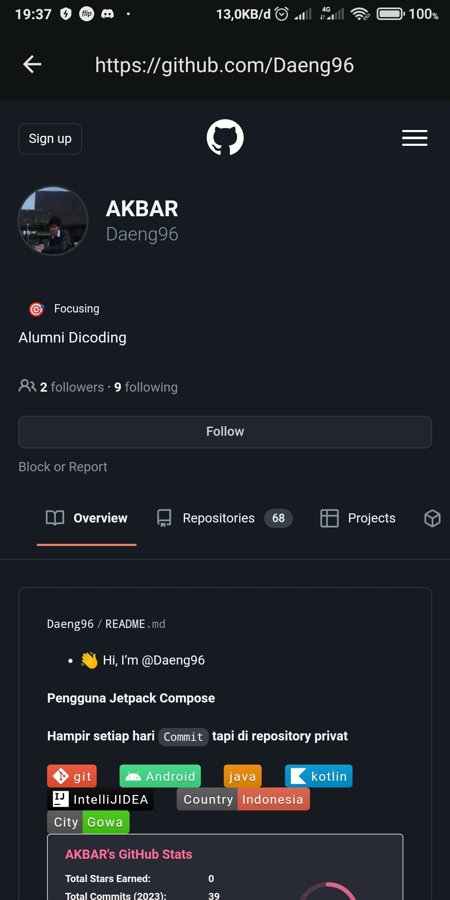

## githubapp

|Dibuat|Diperbarui /  Migrasi ke Jetpack Compose|Versi|
|:--|:--:|--:|
|2020|2023||.

### Preview

|Home|Detail|Setting|Favorite|
|:--|:--:|:--:|--:|
||||
|||||

## Consumerapp

### Preview

|Home|Detail|WebView|
|:--|:--:|--:|
||||

### Fitur
- Mencari pengguna github dan melihat pengikut dan yg diikuti.
- Widget daftar favorite.
- Notifikasi.
- ContentProvider.
- Consumer app

### Pola Arsitektur
- MVVM

### Library
- Room Database
- Retrofit
- RxJava
- Coroutines
